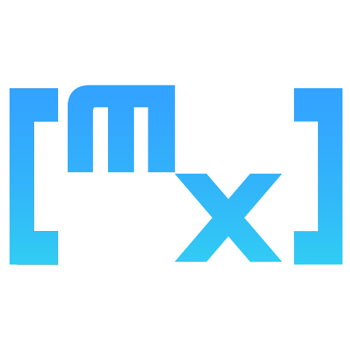

[English](README.md) | [繁體中文](README-zh_TW.md)

<a id="readme-top"></a>

<!-- PROJECT SHIELDS -->
<!--
*** I'm using markdown "reference style" links for readability.
*** Reference links are enclosed in brackets [ ] instead of parentheses ( ).
*** See the bottom of this document for the declaration of the reference variables
*** for contributors-url, forks-url, etc. This is an optional, concise syntax you may use.
*** https://www.markdownguide.org/basic-syntax/#reference-style-links
-->
[![Issues][issues-shield]][issues-url]
[![BSD 3-Clause][license-shield]][license-url]
[![Discord][discord]][discord_url]

<!-- PROJECT LOGO -->
<br />
<div align="center">
    <div>
        
    </div>

 <h3 align="center">Project [matrix] <br /> ～專案的一切，皆從此開始～</h3>

  <p align="center">
    第一人稱 / 第三人稱視角同人英雄射擊遊戲
    <br/>
    由「蔚藍檔案」的粉絲們所製作
    <br />
  </p>
</div>

<!-- TABLE OF CONTENTS -->
<details>
  <summary>文件主題清單</summary>
  <ol>
    <li>
      <a href="#關於企劃">關於企劃</a>
      <ul>
        <li><a href="#技術棧">技術棧</a></li>
      </ul>
    </li>
    <li>
      <a href="#著手準備編譯">著手準備編譯</a>
    </li>
    <li><a href="#專案現況">專案現況</a></li>
    <li><a href="#製作路線圖">製作路線圖</a></li>
    <ul>
      <li><a href="#標籤圖說">標籤圖說</a></li>
    </ul>
    <li><a href="#為專案貢獻">為專案貢獻</a></li>
    <li><a href="#授權條款">授權條款</a></li>
    <li><a href="#聯絡方式">聯絡方式</a></li>
    <li><a href="#特別感謝">特別感謝</a></li>
  </ol>
</details>

<!-- ABOUT THE PROJECT -->
## 關於企劃

<figure align="center">
    <div align="center">
        
    </div>
    <div align="center">
        <figcaption>麻煩請不要在意小綠的衣服，我不是很會使用iMovie :P</figcaption>
    </div>
</figure>
<br />

 "Project [matrix]" 是一個由「蔚藍檔案」的粉絲製作並延伸的第一人稱/第三人稱視角(可切換)同人英雄射擊遊戲。

本專案將完全使用Unreal Engine 5製作，程式語言以Blueprint為主體，若Blueprint程式碼有不足之情況時Rust(主要)與C++語言將會是可選項。

<em>若想知道更多專案細節，敬請參閱 [docs](docs/) 資料夾中所示文件。</em>

<p align="right">(<a href="#readme-top">back to top</a>)</p>

### 技術棧

* [![UnrealEngine][Unreal Engine]][unreal_url]
* [![Rust][Rust]][ferris_url]
* [![C++][C++]][clang_url]
* [![Blender][Blender]][blender_url]
* [![Wwise][wwise]][wwise_url](未定，計劃中)

<p align="right">(<a href="#readme-top">back to top</a>)</p>

<!-- GETTING STARTED -->
## 著手準備編譯

```txt
歡迎各位的到來！

如果您是一位蔚藍檔案的「老師」。

或者，您是一位遊戲程式設計師。

不管您是誰，歡迎來到這個專案。
```

**這個專案暫時還未步上軌道，還未準備完成，在此期間，請參閱以下連結與文件，以了解專案相關細節。**

* [All documents](docs/)
* [High Concept](docs/00_High-Concept.md)
* [Proposal of the project](docs/01-Game-project-proposal.md)

<p align="right">(<a href="#readme-top">back to top</a>)</p>

<!-- PROJECT STATUS -->
## 專案現況

<figure align="center">
    <div align="center">
        
    </div>
    <div align="center">
    <figcaption>來自專案創始人 @hikarisakira:<br />高概念文件與遊戲企劃書正在處理中，我還在製作的路上，再請耐心等候！</figcaption>
    </div>
</figure>

<p align="right">(<a href="#readme-top">back to top</a>)</p>

<!-- ROADMAP -->
## 製作路線圖

*  專案詳細書面文件 
  *  高概念文件
  * [ ] 遊戲企劃書
  * [ ] 一頁式企劃
* [ ] 基本遊戲框架 
  * [ ] 建立專案
  * [ ] 製作基本第三人稱射擊遊戲框架程式
  * [ ] 基於 MMD / VRCHAT 的3D模型導入與功能測試
* [ ] 遊戲概念實驗
  * [ ] 場景破壞
  * [ ] 角色的隨時切換

### 標籤圖說

*  處理中。

*  專案管理(PM)所屬之工作。

  * 包含預估時程表、流程看板、所有書面文件以及大部分的創意發想。

*  程式設計師所屬之工作。

  * 有關遊戲引擎一切相關的工作，包含基本功能、動畫事件、畫面渲染程式...等。

  * Wwise聲效引擎之操作。

*  繪師/藝術家所屬之工作 *本處所指之藝術家包含2D與3D製作 **(也就是建模師)**，為統稱概念。*
(他們所接的工作量真的非常大，為各位繪師與建模師們致上最高的敬意。)

  * UI/UX

  * 動畫製作

  * 3D建模 (包含但不限於場景、角色、場景物品等)

  * 渲染

  * 動效、特效

*  音樂作曲家所屬之工作。

  * 包含各種音效，背景音樂與原聲帶之製作

  * Wwise聲效引擎之操作。

<!--See the [open issues](https://github.com/github_username/repo_name/issues) for a full list of proposed features (and known issues).-->

<p align="right">(<a href="#readme-top">back to top</a>)</p>

<!-- CONTRIBUTING -->
## 為專案貢獻

為一個開放原始碼專案的貢獻，是為了讓開源社區有一個更美好、奇妙的環境去學習、得到靈感與創造美好的事物。

對於任何程式碼的貢獻，只要能讓這個專案乃至於讓整個開源社區變得更美好，**我們都非常支持、鼓勵且歡迎**。

若您有任何建議能讓這個專案進步，變得更好，敬請fork我們的專案存放庫並開啟一個新的pull要求。您也可以簡單地開啟一個新的issue並附上 "enhancement" 標籤。

也請不要忘記給我們的專案一顆星的支持！

再次感謝您支持本專案！

1. Fork 這個專案
2. 創建您的功能分支 (`git checkout -b feature/AmazingFeature`)
3. 發送您的更動 (`git commit -m 'Add some AmazingFeature'`)
4. 推送到您的分支上 (`git push origin feature/AmazingFeature`)
5. 對我們的專案提出Pull要求。

<p align="right">(<a href="#readme-top">back to top</a>)</p>

### 核心概念貢獻者 清單

<a href="https://github.com/github_username/repo_name/graphs/contributors">
  
</a>

<!-- LICENSE -->
## 授權條款

本專案依循BSD-3-Clause授權條款發布，敬請詳閱`LICENSE`檔案以了解更多資訊。

<p align="right">(<a href="#readme-top">back to top</a>)</p>

<!-- CONTACT -->
## 聯絡方式

* Kona Lukxlir(個人頁面，少用) - [Facebook](https://www.facebook.com/real.hikari.sakira)
  
* Momoi Saiba(常用帳號) - [Facebook](https://www.facebook.com/profile.php?id=61554988172841)

* [My Instagram](https://www.instagram.com/air.rinascimento/)

* Email: [hikarisakira@pm.me](mailto:hikarisakira@pm.me)

<p align="right">(<a href="#readme-top">back to top</a>)</p>

<!-- SPECIAL THANKS -->
## 特別感謝

* [韓國Youtuber Sechi 其所開頻道 "BlueSechi" 提供之綠幕素材](https://www.youtube.com/@BlueSechi)

* [Best-README-Template by othneildrew](https://github.com/othneildrew/Best-README-Template)

<p align="right">(<a href="#readme-top">back to top</a>)</p>

<!-- MARKDOWN LINKS & IMAGES -->
<!-- https://www.markdownguide.org/basic-syntax/#reference-style-links -->

[Unreal Engine]: https://img.shields.io/badge/unrealengine-%23313131.svg?style=for-the-badge&logo=unrealengine&logoColor=white

[unreal_url]: https://www.unrealengine.com/zh-CN

[Rust]: https://img.shields.io/badge/rust-%23000000.svg?style=for-the-badge&logo=rust&logoColor=white

[ferris_url]: https://www.rust-lang.org/

[C++]: https://img.shields.io/badge/c++-%2300599C.svg?style=for-the-badge&logo=c%2B%2B&logoColor=white

[clang_url]: https://clang.llvm.org/

[Blender]: https://img.shields.io/badge/blender-%23F5792A.svg?style=for-the-badge&logo=blender&logoColor=white

[blender_url]: https://www.blender.org/

[issues-url]: https://github.com/Proj-matrix/.github/issues

[issues-shield]: https://img.shields.io/github/issues/othneildrew/Best-README-Template.svg?style=for-the-badge

[license-url]: https://github.com/Proj-matrix/.github/blob/master/LICENSE

[license-shield]: https://img.shields.io/github/license/Proj-matrix/.github?style=for-the-badge

[discord]: https://img.shields.io/badge/Discord-%235865F2.svg?style=for-the-badge&logo=discord&logoColor=white

[discord_url]: https://discord.gg

[wwise]: https://a11ybadges.com/badge?logo=wwise

[wwise_url]: https://www.audiokinetic.com/zh/wwise/overview/
