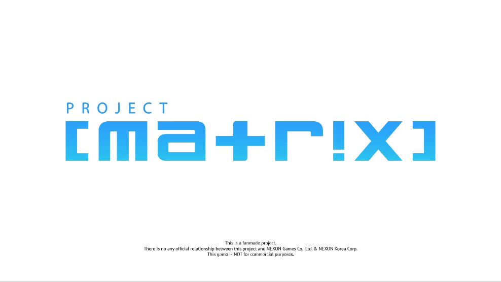

[English](README.md) | [繁體中文](README-zh_TW.md)


<a id="readme-top"></a>


<!-- PROJECT SHIELDS -->
<!--
*** I'm using markdown "reference style" links for readability.
*** Reference links are enclosed in brackets [ ] instead of parentheses ( ).
*** See the bottom of this document for the declaration of the reference variables
*** for contributors-url, forks-url, etc. This is an optional, concise syntax you may use.
*** https://www.markdownguide.org/basic-syntax/#reference-style-links
-->
[![Issues][issues-shield]][issues-url]
[![BSD 3-Clause][license-shield]][license-url]
[![Discord][discord]][discord_url]


<!-- PROJECT LOGO -->
<br />
<div align="center">
    <div>
        
    </div>

 <h3 align="center">Project [matrix] <br /> Here is where the project starts.</h3>

  <p align="center">
    A fan-made First-Person Shooter / Third-Person hero shooter game.
    <br/>
    Made by the fans of "Blue Archive".
    <br />
  </p>
</div>

<!-- TABLE OF CONTENTS -->
<details>
  <summary>Table of Contents</summary>
  <ol>
    <li>
      <a href="#about-the-project">About The Project</a>
      <ul>
        <li><a href="#built-with">Built With</a></li>
      </ul>
    </li>
    <li>
      <a href="#getting-started">Getting Started</a>
    </li>
    <li><a href="#project-status">Project Status</a></li>
    <li><a href="#roadmap">Roadmap</a></li>
    <ul>
      <li><a href="#flag-meanings">Flag Meanings</a></li>
    </ul>
    <li><a href="#contributing">Contributing</a></li>
    <li><a href="#license">License</a></li>
    <li><a href="#contact">Contact</a></li>
    <li><a href="#special-thanks">Special Thanks</a></li>
  </ol>
</details>

<!-- ABOUT THE PROJECT -->
## About The Project


<figure align="center">
    <div align="center">
        
    </div>
    <div align="center">
        <figcaption>plz ignore Midori's outfit, I'm not a iMovie guy lol.</figcaption>
    </div>
</figure>
<br />

"Project [matrix]" is a fan-made First-Person Shooter / Third-Person (camera switchable) Hero shooter game which made by the fans of "Blue Archive".

The project will be built in Unreal Engine 5, mainly using Blueprint, Rust(mostly) and C++ will be an option when Blueprint-based code was not enough to use.

<em>For more information about this project, please check the documentation inside the [docs](docs/) folder.</em>


<p align="right">(<a href="#readme-top">back to top</a>)</p>


### Built With

* [![UnrealEngine][Unreal Engine]][unreal_url]
* [![Rust][Rust]][ferris_url]
* [![C++][C++]][clang_url]
* [![Blender][Blender]][blender_url]
* [![Wwise][wwise]][wwise_url](planning)

<p align="right">(<a href="#readme-top">back to top</a>)</p>


<!-- GETTING STARTED -->
## Getting Started

```txt
Hello, fellas!

If you're a "sensei" of the game "Blue Archive".

Or, if you're a game developer.

Whoever you are, welcome to this project.
```

**While the project was not ready to start, please check these papers to know what this project is going to do.**

* [All documents](docs/)
* [High Concept](docs/00_High-Concept.md)
* [Proposal of the project](docs/01-Game-project-proposal.md)

<p align="right">(<a href="#readme-top">back to top</a>)</p>

<!-- PROJECT STATUS -->
## Project Status

<figure align="center">
    <div align="center">
        
    </div>
    <div align="center">
    <figcaption>The high concept & game project proposal are still going to be made.<br />I'm still on da wae, please wait! @hikarisakira</figcaption>
    </div>
</figure>

<p align="right">(<a href="#readme-top">back to top</a>)</p>

<!-- ROADMAP -->
## Roadmap

-  Project details  
  -  High concept
  - [ ] Game project proposal
  - [ ] One-paged proposal
- [ ] Basic game template  
  - [ ] Project create
  - [ ] Basic third-person shooter template
  - [ ] mmd-based & VRCHAT-based 3d model functionality test
- [ ] Experiment of the game concept
  - [ ] Scene destruction
  - [ ] Character switching

### Flag meanings

-  Now processing
-  Jobs belongs to PMs.

  - Including timeline, Kanban TODOs, documentations and ideas.
-  Jobs belongs to programmers.

  - Including everything about the game engine, like basic functions, animations, shaders...etc.
  - Wwise.

- (not done yet) Jobs belongs to the artists. (And that's a really heavy workloads for the artists. o7)

  - UI/UX
  - Animation
  - 3D modeling (including scenes, characters, items...etc)
  - Shaders
  - VFX

-  Jobs belongs to sound artists.
  - Including SFX, background music, soundtracks.
  - Wwise.

See the [open issues](https://github.com/github_username/repo_name/issues) for a full list of proposed features (and known issues).

<p align="right">(<a href="#readme-top">back to top</a>)</p>

<!-- CONTRIBUTING -->
## Contributing

Contributions are what make the open source community such an amazing place to learn, inspire, and create. Any contributions you make are **greatly appreciated**.

If you have a suggestion that would make this better, please fork the repo and create a pull request. You can also simply open an issue with the tag "enhancement".
Don't forget to give the project a star! Thanks again!

1. Fork the Project
2. Create your Feature Branch (`git checkout -b feature/AmazingFeature`)
3. Commit your Changes (`git commit -m 'Add some AmazingFeature'`)
4. Push to the Branch (`git push origin feature/AmazingFeature`)
5. Open a Pull Request

<p align="right">(<a href="#readme-top">back to top</a>)</p>

### Contributors of the core concept:

<a href="https://github.com/github_username/repo_name/graphs/contributors">
  
</a>

<!-- LICENSE -->
## License

Distributed under the BSD 3-Clause License. See `LICENSE` for more information.

<p align="right">(<a href="#readme-top">back to top</a>)</p>


<!-- CONTACT -->
## Contact

- Kona Lukxlir(my personal info, not mainly used) - [Facebook](https://www.facebook.com/real.hikari.sakira) 
  
- Momoi Saiba(use often) - [Facebook](https://www.facebook.com/profile.php?id=61554988172841) 

- [My Instagram](https://www.instagram.com/air.rinascimento/)

- Email: [hikarisakira@pm.me](mailto:hikarisakira@pm.me)

<p align="right">(<a href="#readme-top">back to top</a>)</p>

<!-- SPECIAL THANKS -->
## Special Thanks

- [Chroma key & animation from Mr. Sechi's channel "BlueSechi"](https://www.youtube.com/@BlueSechi)

- [Best-README-Template by othneildrew](https://github.com/othneildrew/Best-README-Template)

<p align="right">(<a href="#readme-top">back to top</a>)</p>

<!-- MARKDOWN LINKS & IMAGES -->
<!-- https://www.markdownguide.org/basic-syntax/#reference-style-links -->

[Unreal Engine]: https://img.shields.io/badge/unrealengine-%23313131.svg?style=for-the-badge&logo=unrealengine&logoColor=white

[unreal_url]: https://www.unrealengine.com/zh-CN

[Rust]: https://img.shields.io/badge/rust-%23000000.svg?style=for-the-badge&logo=rust&logoColor=white

[ferris_url]: https://www.rust-lang.org/

[C++]: https://img.shields.io/badge/c++-%2300599C.svg?style=for-the-badge&logo=c%2B%2B&logoColor=white

[clang_url]: https://clang.llvm.org/

[Blender]: https://img.shields.io/badge/blender-%23F5792A.svg?style=for-the-badge&logo=blender&logoColor=white

[blender_url]: https://www.blender.org/

[issues-url]: https://github.com/Proj-matrix/.github/issues

[issues-shield]: https://img.shields.io/github/issues/othneildrew/Best-README-Template.svg?style=for-the-badge

[license-url]: https://github.com/Proj-matrix/.github/blob/master/LICENSE

[license-shield]: https://img.shields.io/github/license/Proj-matrix/.github?style=for-the-badge

[discord]: https://img.shields.io/badge/Discord-%235865F2.svg?style=for-the-badge&logo=discord&logoColor=white

[discord_url]: https://discord.gg

[wwise]: https://a11ybadges.com/badge?logo=wwise

[wwise_url]: https://www.audiokinetic.com/zh/wwise/overview/
