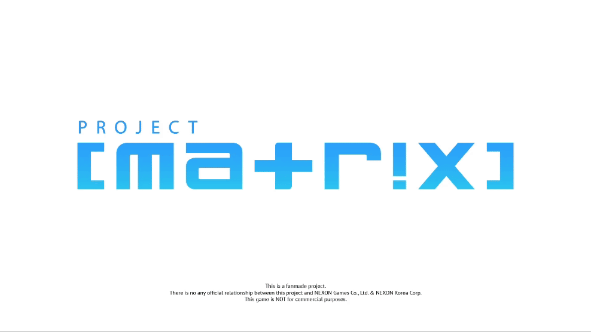

# Project [matrix]  [English](README.md) | [繁體中文](README-zh_TW.md)

請注意：若您想為此專案做任何貢獻，或是想知道更多資訊，請先查看".github"存放庫的文件檔。

[repo:Proj-matrix/.github](https://github.com/Proj-matrix/.github)

## 來個簡單的專案簡介吧。

 "Project [matrix]" 是一個由「蔚藍檔案」的粉絲製作並延伸的第一人稱/第三人稱視角(可切換)同人英雄射擊遊戲。

本專案將完全使用Unreal Engine 5製作，程式語言以Blueprint為主體，若Blueprint程式碼有不足之情況時Rust(主要)與C++語言將會是可選項。

<figure>
    
    <figcaption>麻煩請不要在意小綠的衣服，我不是很會使用iMovie :P</figcaption>
</figure>
